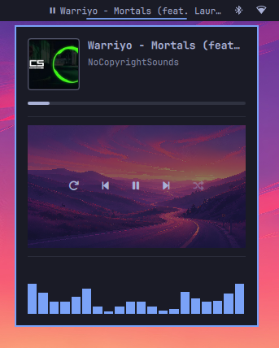

# OmniMedia

A friendly little music widget for the Omarchy status bar.

The bar icon shows the current track (and a playing/paused state). Hover it to
open a popup with album art, a draggable progress bar, playback controls, and a
live audio visualizer.

> **Status: In development.** This project is a work in progress. Features may
> change or break between updates, and not everything is polished yet. Feedback,
> bug reports, and feature ideas are very welcome.

## Overview



## Features

- Now-playing info on the bar: song name + play/pause state
- Popup with album art, title, and artist
- Progress bar — drag to seek
- Controls: repeat, previous, play/pause, next, shuffle
- Audio visualizer (cava) while the popup is open
- Switches between players (e.g. cliamp + YouTube Music) automatically,
  with a clickable source list when more than one is active
- **Download YouTube tracks** — save the currently playing YouTube track as a
  tagged MP3 file with embedded metadata and album artwork

## Requirements

- Omarchy (the shell plugin API)
- `cava` — needed for the visualizer. Install it if you want the visualizer.
- `yt-dlp` — required for the download feature. Install it if you want to
  download tracks.
- `ffmpeg` — required by yt-dlp for audio conversion. Install it alongside
  yt-dlp.

## Install

1. Put this folder in your user plugin directory:

   ```sh
   mkdir -p ~/.config/omarchy/plugins
   cp -r omnimedia ~/.config/omarchy/plugins/
   ```

2. Enable the plugin:

   ```sh
   omarchy plugin enable omnimedia
   ```

3. Add it to the bar (the right side is the default):

   ```sh
   omarchy bar put omnimedia --section right
   ```

4. Restart the shell to pick everything up:

   ```sh
   omarchy restart shell
   ```

## Uninstall

1. Remove the widget from the bar and disable the plugin:

   ```sh
   omarchy plugin disable omnimedia
   ```

2. Delete the plugin folder:

   ```sh
   rm -rf ~/.config/omarchy/plugins/omnimedia
   ```

3. Restart the shell to drop everything:

   ```sh
   omarchy restart shell
   ```

## Use

- Hover the music icon on the bar to open the popup.
- Drag the progress bar to seek.
- Use repeat / previous / play-pause / next / shuffle to control playback.
- Repeat and shuffle light up with a background while active. If the current
  player doesn't support them (for example YouTube Music), the widget does its
  best: repeat loops the current track on its own, and shuffle stays greyed out
  since it can't be controlled.
- With multiple players open, click a source in the list to switch to it.

### Downloading tracks

When a YouTube track is playing, a **Download MP3** button appears below the
visualizer. Click it to save the track to `~/Music` as a tagged MP3 file.

- The download includes embedded title, artist, album, and cover artwork.
- A progress percentage is shown while the download is active.
- Click the button again to **cancel** an in-progress download.
- If a download fails, the button shows the error and can be clicked to
  **retry**.
- If `yt-dlp` or `ffmpeg` is not installed, the button shows a message
  indicating which dependency is missing.

Downloaded files are named `Artist - Title.mp3` (with unsafe filesystem
characters removed). Existing files are not overwritten.

## Future plans

- **Lyrics support** — show synced/unsynced lyrics for the current track in the
  popup.
- **More cava designs** — alternative visualizer styles/themes for the cava
  output, switchable from the popup.
- More polish on the progress bar and playback control fallbacks.

## Contributing

Contributions are welcome! Ideas, bug reports, and pull requests are all
appreciated, especially around the future plans above. Please keep changes in
line with the existing code style and note that contributed code falls under
the same license as the rest of the project.

## Notes

- `cliamp` repeat/shuffle are driven through the `cliamp` CLI. Other players
  use the standard MPRIS interface.
- Changes to files in `~/.config/omarchy/plugins/` hot-reload; a full
  `omarchy restart shell` is recommended after editing `Widget.qml`.

## License

See [LICENSE](LICENSE). In short: you may use, modify, and redistribute this
plugin freely, as long as you include the copyright notice and permission notice
from the original LICENSE in any copies or substantial portions of the software.
